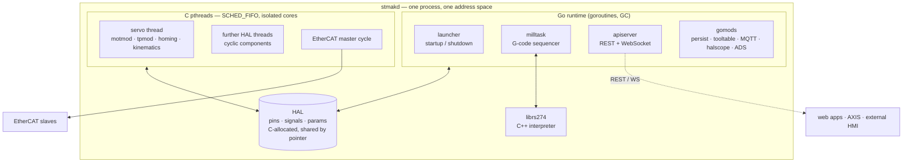
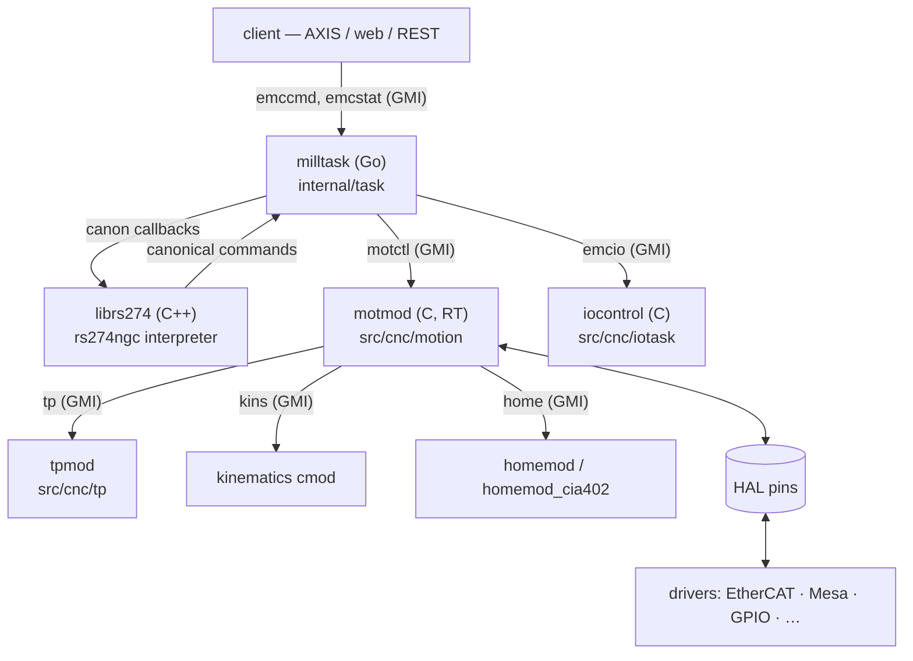

# stratuMAK architecture

Orientation for people about to change the code. It describes what is in the
tree **today**, including the places where the migration is still visibly
half-finished — those seams are where most contribution happens, so they are
named rather than smoothed over.

`README.md` covers *why* the project exists and what it claims; this document
covers *how it is built*. Read that first if you have not.

---

## 1. The shape of the system

One process. `stmakd` is a single Go binary that links the HAL runtime, the
G-code interpreter and the API server directly, and loads everything else as
plugins into its own address space.



Two rules follow from this picture, and nearly every design decision in the
tree is downstream of them:

- **Go never runs in the real-time path.** RT threads are plain C pthreads
  created by the RTAPI layer. They are never attached to the Go runtime, so
  the garbage collector's stop-the-world cannot reach them. This is structural,
  not a tuning choice — see §6.
- **Everything shares one address space.** Go and C exchange data through
  C-allocated memory by pointer. There is no serialization, no IPC and no
  shared-memory segment between domains.

### What happened to the classic architecture

| LinuxCNC 2.9 | stratuMAK |
|---|---|
| `linuxcncsvr`, `milltask`, `io`, `halcmd` as separate processes | one `stmakd` process |
| NML message channels between them | GMI typed calls in-process (§5) |
| RT kernel modules or `rtapi_app` process | cmods `dlopen`ed into `stmakd` (§4) |
| HAL in SysV shared memory | HAL on the process heap, C-allocated |
| Python/Tcl non-RT layer | Go |
| Tk/GTK UIs over NML | Vue/TS over REST+WS; AXIS ported to the REST client |

No trace of NML remains in the tree. What outlived it are two unrelated
libraries that had been living under `src/libnml/` — the C INI parser (C
modules read INI) and the pose-math library — and they now sit at
`src/inifile/` and `src/posemath/`.

---

## 2. Source map

| Path | What lives there | Language |
|---|---|---|
| `src/stmak/` | The Go server: launcher, task, API server, HAL bindings, tooling | Go (+cgo) |
| `src/stmak/pkg/` | Public surface: `hal`, `inifile`, `stmak` (gomod registration), `cmodule` (C headers) | Go, C headers |
| `src/stmak/internal/` | Everything else — one directory per subsystem | Go |
| `src/stmak/internal/hallib/` | `hal_lib.c` + the uspace RTAPI implementation, compiled into the binary | C |
| `src/stmak/cmd/` | `stmakd`, `halcmd`, `modcompile`, `halsampler`, `halstreamer`, `ethercat`, `ads-xml-gen` | Go |
| `src/gmi/` | IDL definitions (`idl/*.gmi`), the C runtime `libgmi`, the Python client shim | IDL, C, Python |
| `src/cnc/` | Inherited CNC core: `rs274ngc` interpreter, `motion`, `tp`, `kinematics`, `iotask`, UIs | C/C++ |
| `src/hal/` | HAL components (`components/*.comp`), drivers (Mesa, EtherCAT, GPIO, VFDs), ClassicLadder | C, `.comp` |
| `src/rtapi/` | RTAPI headers and the small uspace support pieces | C |
| `src/posemath/` | Pose/vector math (`libposemath`), inherited | C |
| `src/inifile/` | The C INI parser (`libiniparse`) and `inivar`, inherited | C |
| `src/webapp/` | Vue + TypeScript web applications | TS/Vue |
| `lib/hallib/` | Shipped HAL files, Go-templated (§7) | HAL |
| `lib/python/` | Python client libraries and the remaining Python UIs | Python |
| `configs/` | Example and simulation machine configurations | INI/HAL |
| `tests/` | The runtest suite | shell/Python |
| `docs/src/` | User and integrator manual (AsciiDoc, built into the PDFs/HTML) | AsciiDoc |
| `docs/dev/` | This directory — engineering record, design notes, review findings | Markdown |

Roughly: `src/stmak` and `src/gmi` are new; `src/cnc`, `src/hal`, `src/rtapi`
are inherited from LinuxCNC 2.9 and evolved in place. When touching inherited
C, the 2.9 sources are the parity oracle — much of the review program consisted
of diffing against them.

---

## 3. Two planes: HAL and GMI

The single most useful thing to internalise. stratuMAK has **two** distinct
inter-module mechanisms and they are not interchangeable.

|  | HAL | GMI |
|---|---|---|
| Carries | scalar values: `bit`, `float`, `s32`, `u32`, `port` | typed structs, strings, slices, maps |
| Shape | published state, sampled every cycle | request → response function call |
| Wiring | `net` in a HAL file, at load time | name lookup in a registry, at start time |
| RT | yes — this is what the servo cycle reads and writes | no — never called from a cyclic funct |
| Reaches outside | via `halcmd` / the HAL REST surface | directly, if `@rest_export` |
| Defined in | the component's pin declarations | `src/gmi/idl/*.gmi` |

Rule of thumb: **if the servo loop needs it every cycle, it is a HAL pin. If it
is a command, a query, or anything with structure, it is a GMI call.** A tool
table entry is GMI. A commanded joint position is HAL. Getting this wrong is
the most common architectural mistake in new code.

---

## 4. HAL

The Hardware Abstraction Layer is inherited from LinuxCNC and largely unchanged
in concept: components create **pins**, pins are connected by **signals**,
components export **functs**, and functs are added to **threads** that run at a
fixed period.

What changed is where it lives. `internal/hallib` compiles `hal_lib.c`, the
uspace RTAPI implementation and its string helpers **directly into the `stmakd`
binary** — blank-import the package and the HAL runtime is linked. HAL data
sits on the process heap allocated by C; there is no shared-memory segment, no
`liblinuxcnchal.so` and no separate `rtapi_app` process. Every component — Go
or C — uses the same in-process HAL.

Go code reaches HAL through `src/stmak/pkg/hal` (`Component`, `Pin`, typed
accessors). C modules reach it through the `stmak_hal_t` vtable in their
environment (§5). Both end up in the same `hal_lib.c`.

### The RT cycle

```
newthread servo-thread 1000000 fp     # period in ns, created in the HAL file
addf motmod.do-servo servo-thread     # order of addf is order of execution
addf pid.x.do-pid-calcs servo-thread
```

`newthread` creates a real pthread via RTAPI, sets `SCHED_FIFO`, and pins it to
a CPU. `thread_task()` in `hal_lib.c` is the whole cycle: walk the funct list,
call each `funct(arg, period)` in order, record per-funct execution time, bump
the cycle counter, `rtapi_wait()` until the next period. There is no scheduler
between functs and no allocation in the loop.

CPU assignment is automatic: the launcher reads
`/sys/devices/system/cpu/isolated` into a pool (`internal/halcmd/cpupool.go`)
and hands isolated physical cores to threads as they are created. An explicit
`cpu=N` overrides it.

### Tooling

`halcmd` is a Go program that drives the running server through a generated
REST client against `/api/v1/halcmd` — it is a client, not a process that
attaches to shared memory. The same command set (`load`, `net`, `setp`, `addf`,
`show`, `unload`, …) is available in HAL files, from the CLI, and over REST.
Runtime `load`/`unload` over that surface is a supported production path, which
is why the launcher serializes it against shutdown.

---

## 5. GMI — the typed call plane

GMI (Generated Message Interface) replaces NML. An interface is declared once
in an IDL file under `src/gmi/idl/`, and `modcompile gmi` generates everything
needed to call it from anywhere.

```
@api tooltable
@version 1
@rest_export true

type ToolEntry {
    pocketno: i32    @min(0) @max(1000)
    comment:  string @maxlen(255)
}

@method "GET"
@path "/tool/{toolno}"
@rc_error
func get_tool(toolno: i32 @min(1), entry: ToolEntry out) -> i32
```

Generated from that one file: a C header with callback typedefs and
registration helpers, Go dispatch and bridge code, `//export` trampolines,
REST/WebSocket handlers with constraint validation, and client libraries for
Go, C, Python and TypeScript.

**Generated code is not committed.** It lands in `src/generated/` which is
`.gitignore`d in full. If you change an IDL file, the build regenerates; if you
find a bug in generated output, fix the generator in
`internal/gmicompile/cgen/`, never the output.

### The four call directions

All four work and are exercised by tests:

| Caller → callee | Mechanism |
|---|---|
| cmod → cmod | C function pointers from the shared registry |
| gomod → cmod | Go calls C through the generated cgo bridge |
| gomod → gomod | Go interfaces via the registry |
| cmod → gomod | C calls Go through `//export` trampolines |

### Registry and instances

An API is registered as `name:instance`. `motctl:motmod` and `motctl:pnp.mot`
are two live instances of the same interface. Consumers look up by name, which
is what makes multiple independent machines in one process possible (§7).

### The REST boundary

`@rest_export true` puts the API on `/api/v1/<instance>/<path>`. Watch-style
functions push over the WebSocket at `/watch`; binary streams (scope, sampler)
use `/stream/`.

Failures are classified, not lumped into 500 — a Go provider returns
`apiserver.NewFault(...)` and the kind picks the status:

| kind | status | meaning |
|---|---|---|
| `FaultState` | 409 | the machine's state forbids it; retrying unchanged fails identically |
| `FaultNotReady` | 503 | module not started; may succeed shortly |
| `FaultCapacity` | 503 | running and healthy, but full |
| `FaultNotFound` | 404 | no such thing |
| `FaultInternal` | 500 | the controller itself broke |

The distinction matters: 500 is what monitoring escalates on, and most refusals
on a command surface are the machine correctly declining, which is a 409. Note
also that a command *accepted and then faulted* is not a transport error at all
— it is a machine event on the error channel, reported as `RCS_ERROR` in a
normal response.

The full type system, constraint annotations (`@min`, `@regex`, …), nullable
semantics (`T?`) and the `@rc_error` shape are documented in
`src/gmi/idl/README.md`; the design rationale is in
[DYNAMIC_API_DESIGN.md](DYNAMIC_API_DESIGN.md) and
[FIELD_VALIDATION_DESIGN.md](FIELD_VALIDATION_DESIGN.md).

---

## 6. Components: cmod, gomod, `.comp`

### cmod — C shared library

A `.so` in `cmod/`, `dlopen`ed by the launcher. It exports `New()` and receives
a `cmod_env_t` (`src/stmak/pkg/cmodule/stmak_env.h`) containing vtables for
log, INI, HAL, RTAPI, dynamic APIs and path resolution. A module has **no
direct symbol dependency** on the server or on other modules — everything
arrives through that structure.

Lifecycle: `New()` → `Init()` → `Start()` → `Stop()` → `Destroy()`.

The header carries `CMOD_ABI_VERSION`, stamped automatically into every module
that includes it. The launcher checks it via `dlsym` before calling `New()`, so
a module built against a different environment layout is refused at load rather
than reading wrong offsets. Bump it whenever `cmod_env_t`, a sub-API struct, a
callback signature or a lifetime guarantee changes.

cmods cover three execution styles, and one module may combine them:
**cyclic** (a funct on a HAL thread — PID, filters, interpolation),
**triggered** (start pin, busy/result — homing, tool change, probing), and
**threaded** (own non-RT thread — device I/O, protocol handlers).

The motion controller (`motmod`), trajectory planner (`tpmod`), homing modules,
kinematics, and every hardware driver are cmods.

### gomod — Go module

Registered at `init()` with `stmak.RegisterModule(name, factory)` and
**compiled into the binary**, not loaded as a plugin. `src/stmak/packages.conf`
lists which packages are linked in, gated by build flags.

Lifecycle mirrors the cmod one: factory → `Start()` → `Stop()` → `Destroy()`.
Two contract points bite people:

- The factory must return a **fully constructed** module. A later module's load
  failure aborts startup and the launcher tears down everything already loaded,
  so `Stop`/`Destroy` must be safe against whatever the factory returned.
- `Stop` must be safe **without a preceding or successful `Start`** — the
  launcher stops every loaded module even when a peer's `Start` failed, and it
  keeps no per-module started flag.

Current gomods: `milltask`, `ngcpreview`, `tooltable`, `persist_sqlite`,
`halscope`, `mqttbridge`, `classicladder`, `emccalib`, `haljson`, `pyvcp`, the
ADS server, and test helpers.

**ClassicLadder is the worked end-to-end example** of a full subsystem
migration, and the best thing to read before attempting another: a C RT engine
under `internal/classicladder`, a Go gomod around it, its own `.gmi` interface,
a Vue web app, AXIS and launcher integration, and runtests — with the engine
differentially verified against a headless build of the 2.9 sources
(`internal/classicladder/testdata/oracle`, `oracle_test.go`). That oracle
pattern is worth copying wherever an inherited algorithm is being reimplemented.

### `.comp` — the component compiler

`modcompile` (Go, `src/stmak/cmd/modcompile`) compiles `.comp` files into C and
then into cmods. 109 components and 3 drivers are built this way. The format is
the classic LinuxCNC one plus GMI wiring:

```
component millturn "Switchable kinematics for a mill-turn machine";
pin in u32 demo_in = 0 "example input pin";
function fdemo;
gmi_provide kins;
license "GPL";
;;
```

`gmi_provide` / `gmi_consume` generate the registration and lookup glue, so a
`.comp` can serve or call a typed API without hand-written bridge code.
Generated functs are annotated `STMAK_NONBLOCKING` automatically.

`modcompile` is also the GMI compiler (`modcompile gmi ...`) and the external
module builder (`modcompile add-gomod`). It is built first in the build order
because everything else depends on its output.

---

## 7. Real-time rules

The RT path is: any funct on a HAL thread, plus the EtherCAT master cycle and
everything they call.

**In the RT path you may not** allocate, take a lock that a non-RT thread can
hold, call anything that can block, use static locals, or call into Go.

**This is compiler-enforced, not convention.** Functions on the RT path are
declared `STMAK_NONBLOCKING` (`stmak_rt_check.h`, mirroring `RTAPI_NONBLOCKING`
in `rtapi.h`), and `make rt-effects-check` compiles the RT translation units
with clang's `-Wfunction-effects` as an error. It verifies transitively across
RTAPI/HAL core, the halscope sampler, `motmod`, `tpmod`, the homing modules,
the EtherCAT driver, the Mesa hostmot2 driver, and every freshly generated
`.comp`. On gcc and older clang the annotations expand to nothing, so
production builds are unaffected.

Where a call genuinely cannot be verified — a libc or vendor primitive that is
non-blocking in practice — wrap it in `STMAK_NONBLOCKING_TRUSTED_BEGIN/END`
with a justification comment. Each of those is a trust boundary of the RT path;
they are greppable on purpose.

The supporting runtime work happens once at startup in
`internal/hallib/uspace_rtapi_lib.c`: `mlockall(MCL_CURRENT)` (deliberately
without `MCL_FUTURE`, which would fight the Go heap), per-region `mlock` plus
write-prefault for module segments, `mallopt(M_TRIM_THRESHOLD/M_MMAP_MAX)` so
glibc stops returning pages, and `/dev/cpu_dma_latency` held open to pin the
C-state.

**Go stays out by construction, not by discipline**: the RT cycle dispatches
only C function pointers from `thread_task()`, and RT threads are created by
`pthread_create` outside the Go runtime. Where RT and Go must exchange
streaming data (halscope), the buffer is C-allocated and both sides use
identical C11 acquire/release atomics.

Full status and the audit trail: [RT_HARDENING_CHECKLIST.md](RT_HARDENING_CHECKLIST.md).

---

## 8. The CNC stack



**milltask** (`internal/task`, the largest Go package at ~25k lines) is the
sequencer: it owns the interpreter instance, the mode/state machine, MDI and
program queues, tool handling and the operator message list. It is a gomod
named `milltask`.

**The interpreter** is the inherited C++ `rs274ngc`, built as `librs274` and
linked into `stmakd` through cgo. It calls back into Go through a **canon
callback table** — `canon.gmi` defines the interface, and
`canon_bridge_init.go` builds a C table of `//export`ed Go functions and hands
it to the interpreter. So G-code execution runs C++ → Go → GMI → C RT, all
in-process.

**Motion** (`motmod`) is inherited C running as a cyclic funct on the servo
thread. Go commands it through the `motctl` API and reads state through
`motstat`. Trajectory planning, kinematics and homing are separate cmods behind
their own GMI interfaces, which is what makes them swappable per config
(`[JOINT_n]HOMEMOD`, the `-t`/`-m` launcher flags).

**iocontrol** exists in two variants (`ioControl.c`, `ioControl_v2.c`), both
cmods — one of the visible seams from the NML-process rewrite.

**ngcpreview** is a gomod that runs a *separate* interpreter instance with a
recording canon to produce backplot previews, so a preview never disturbs the
running program's interpreter state.

---

## 9. Configuration and startup

### Configuration inputs

- **INI file** — machine configuration, classic LinuxCNC format. `#INCLUDE` is
  expanded into a `.expanded` sibling at startup because the C INI parser used
  by modules does not handle includes.
- **HAL files** — module loading and signal wiring, processed as **Go
  templates** before parsing. `ini`, `seq`, string and math helpers are
  available, so a HAL file can size itself to the configured joint count:

  ```
  {{- range $j := seq 0 .Joints}}
  {{- $mod := or (ini (printf "JOINT_%d" $j) "HOMEMOD") "homemod"}}
  load {{$mod}} <homemod.{{$j}}>
  {{- end}}
  ```
- **XML** — EtherCAT slave configuration.
- **REST** — runtime changes: pin values, signal routing, loading and unloading
  modules.

### The `load` command

```
load <module> <inst1,inst2,...> key=value ...
```

The angle-bracket list names instances. `load milltask halui=halui` creates one
instance named `milltask`; `load homemod <homemod.0,homemod.1>` creates two.
Instance names are what GMI consumers look up, and what INI namespacing keys
off — a `milltask` instance named `pnp.task` reads `[pnp.task:TRAJ]` with
fallback to `[TRAJ]`. That is the whole multi-instance mechanism: several
complete, independent machines in one process, addressed by name.

### Startup sequence

`launcher.Run()` (`internal/launcher/launcher.go`), in order:

1. Create the API registry; bind the REST listener early so a taken port fails
   before the machine comes up.
2. Parse INI, expand `#INCLUDE`, `chdir` to the config directory, install the
   path resolver.
3. Validate cross-section INI dependencies; version and PlasmaC migration checks.
4. Start the realtime environment; initialise RTAPI and the log ring.
5. `hal_init` for the launcher's own component; build the isolated-CPU pool.
6. Execute `[HAL]HALFILE` entries — `load` (cmods `dlopen`ed, gomods
   instantiated), then `net`/`addf`/`setp`.
7. Execute `[HAL]HALCMD` entries; restore retained signals; lock HAL memory.
8. Start HAL threads, then start all modules.
9. Serve the REST API. Block until SIGINT/SIGTERM, then tear down in reverse.

`POSTGUI_HALFILE` is deliberately *not* loaded here — that belongs to the
display client, after it has created its own pins.

### Path resolution

Configuration paths are **server-side paths**, resolved by one shared rule
(tilde → `LIB:` → absolute → config dir → `HALLIB_PATH`) with containment
validation, in `internal/pathres`. Client-side path guessing was removed. The
inventory of every affected call site is
[PATH_RESOLUTION_INVENTORY.md](PATH_RESOLUTION_INVENTORY.md).

---

## 10. Client surface

Everything outside the process talks REST + WebSocket on `/api/v1`.

- **Web applications** (`src/webapp/`, Vue 3 + TypeScript, served by `stmakd`):
  halscope, halshow, tooledit, emccalib, latency, linuxcnctop, classicladder.
  Each builds independently; a shared ESLint toolchain gates them.
- **Python shim** (`src/gmi/python/`, installed as `lib/python/gmi/`): a
  drop-in replacement for the classic `linuxcnc` Python module — `gmi.Command()`,
  `gmi.Stat()`, `gmi.Error()` with the same method names and constants, backed
  by REST calls and watch sockets.
- **AXIS** is ported onto that shim and is the working full machine UI. It
  selects its instance with `STMAK_TASK_INSTANCE`.
- **Generated clients** for Go, C, Python and TypeScript come out of the same
  IDL, so a new UI in any of those languages needs no hand-written protocol code.

The remaining GTK/Qt UI stack (GladeVCP, QtVCP, gmoccapy, Touchy) is **not yet
ported**, but the path is designed rather than open. `pyvcp` has already been
migrated to the widget-centric server-side model, and
[VCP_MIGRATION.md](VCP_MIGRATION.md) carries that forward: because qtvcp's
`Status` subclasses gladevcp's `GStat`, the two are architecturally identical
and share **one** unified panel module. The document holds the widget-class →
`WidgetType` mapping with per-toolkit pin specs, verified widget by widget
against `lib/python/gladevcp/` and `lib/python/qtvcp/widgets/`, plus the list of
widgets that create pins but have no `WidgetType` yet. That mapping is the work
list for whoever picks this up.

---

## 11. Build

Autoconf + make, inherited from LinuxCNC. Run-in-place is the normal
development mode.

```bash
git submodule update --init          # the IgH EtherCAT master
cd src && ./autogen.sh && ./configure && make -j$(nproc)
. scripts/rip-environment
```

Build order matters and is enforced by `SUBDIRS` ordering:

1. `modcompile` is built first (it is a Go program with no generated deps).
2. `modcompile gmi` runs over every `.gmi` file → `src/generated/gmi/<api>/`.
3. `modcompile regenerate-imports` writes the blank-import list from
   `packages.conf` + the generated packages.
4. The Go build produces `stmakd` and the other Go binaries.
5. `.comp` files and the C drivers compile into `cmod/*.so`.
6. Web apps build; the EtherCAT submodule is bootstrapped, configured, built
   and installed into the build tree automatically.

Out-of-tree modules build against an installed system via
`modcompile add-gomod` / the installed `stmak_*.h` headers; the layout and its
rationale are in [EXTERNAL_MODULE_INSTALL_DESIGN.md](EXTERNAL_MODULE_INSTALL_DESIGN.md).

---

## 12. Tests and gates

| Gate | Command | Covers |
|---|---|---|
| Runtest suite | `scripts/runtests` | ~250 end-to-end machine tests, the fully ported classic suite |
| Go unit tests | `make stmak-test` | `go vet` + `go test` (202 test files) |
| Race detector | `make stmak-test-race` | nightly |
| Go lint / format | `make stmak-lint`, `stmak-fmt-check` | pinned golangci-lint v2.12.2, standard linter set |
| C warnings | `scripts/check-stmak-cwarnings` | stmak-owned C paths |
| Static checks | `scripts/check-static` | shell + C analyzers |
| RT effects | `make rt-effects-check` | clang function-effects over the RT path (§7) |
| Web apps | `scripts/check-webapps.sh` | lint + type-check + unit tests |
| Packaging | `scripts/package-gate.sh` | deb contents, lintian, install, smoke, external-module compile |

CI runs the build twice (gcc and clang) plus the stmak, static-check, docs and
packaging jobs on every pull request.

Two conventions worth knowing before you send a patch:

- **Every fix carries a test that would have caught it.** This is the rule the
  review program ran under and it is why the suite has no xfails.
- `tests/DISPOSITION.md` is the authoritative ledger for any test that does not
  run-and-pass green, and for every `expected` oracle rebaselined from classic
  output. If you change what a test asserts, that file is where the reasoning
  goes.

---

## 13. Seams — where the architecture is still moving

Named deliberately; these are the useful places to contribute.

- **Two iocontrol implementations** (`ioControl.c` and `ioControl_v2.c`) coexist
  from the NML-process rewrite.
- **GTK/Qt UI stack unported — designed, not built.** GladeVCP and QtVCP are
  currently unimportable: the chain hits `hal_glib` → `_hal`, a C module nothing
  in the tree builds any more, so the toolkit question is not even reached yet.
  [VCP_MIGRATION.md](VCP_MIGRATION.md) specifies the replacement — one unified
  panel module for both, with the widget → pin mapping already worked out. This
  is the largest well-specified piece of work currently on the table.
- **Configuration format.** INI + HAL + XML is a deliberate migration-era
  choice, not the end state. A unified structured configuration is the goal;
  nothing has been designed in tree yet.
- **No API authentication.** The REST/WS surface trusts its network. The plan is
  an external gateway plus in-process authorization — designed, not built. Keep
  it on loopback.
- **Online change** (replace a running component without stopping the machine)
  needs a transfer-plan architecture and stable symbol export. The
  `New()`/`Destroy()` lifecycle already supports the load/unload mechanics;
  state transfer and the atomic swap are missing.
- **Example configurations.** Some shipped configs still assume the classic
  model and have not been migrated.

The full register — parity gaps against LinuxCNC 2.9 plus the designed-but-unbuilt
capabilities — is [MISSING_FEATURES.md](MISSING_FEATURES.md);
the per-module verification matrix and open items are in
[PRODUCTION_READINESS.md](PRODUCTION_READINESS.md).

---

## 14. Making a change

| You want to | Start at |
|---|---|
| Add a HAL component | `src/hal/components/*.comp` — copy a neighbour, add to the Submakefile |
| Add a hardware driver | `src/hal/drivers/` (cmod) — RT rules of §7 apply in full |
| Add or change an API | `src/gmi/idl/*.gmi`, then implement the provider; never edit generated code |
| Add a non-RT service | a gomod under `src/stmak/internal/`, registered in `packages.conf` |
| Change G-code behaviour | `src/cnc/rs274ngc` (interpreter) or `internal/task` (sequencing) — check against 2.9 |
| Change motion behaviour | `src/cnc/motion` (RT C), or `src/cnc/tp` for the planner |
| Add a UI | `src/webapp/` with a generated TS client, or any language with a generated client |
| Add a machine test | `tests/<name>/` with `test.hal`/`test.sh` + `expected` |

Conventions:

- C follows `src/CodingStyle` (4-space indent, K&R braces) — the inherited
  LinuxCNC style.
- Go is standard: `gofmt`, the standard golangci-lint set clean, no global
  errcheck suppressions.
- Comments explain *why*, and cite the finding ID or design section they came
  from where one exists (`// See ADS_REVIEW_FINDINGS.md A7`). Those citations
  are load-bearing — [docs/dev/README.md](README.md) explains the convention.
- Match the surrounding code's density and idiom rather than importing a
  different house style into a file.
