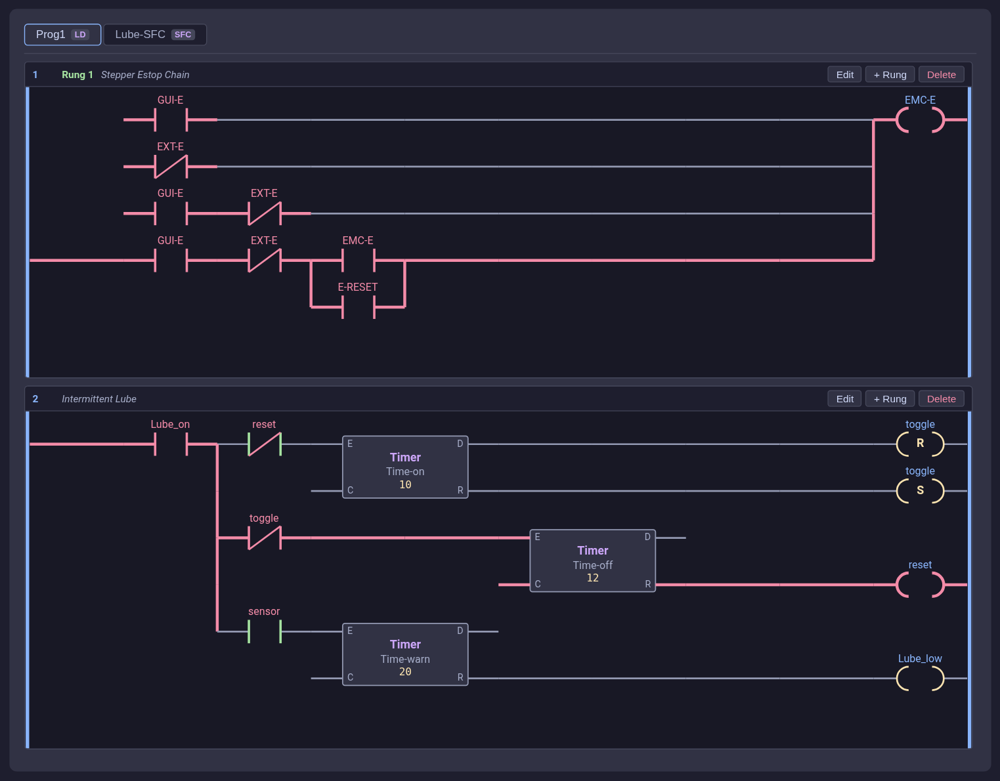
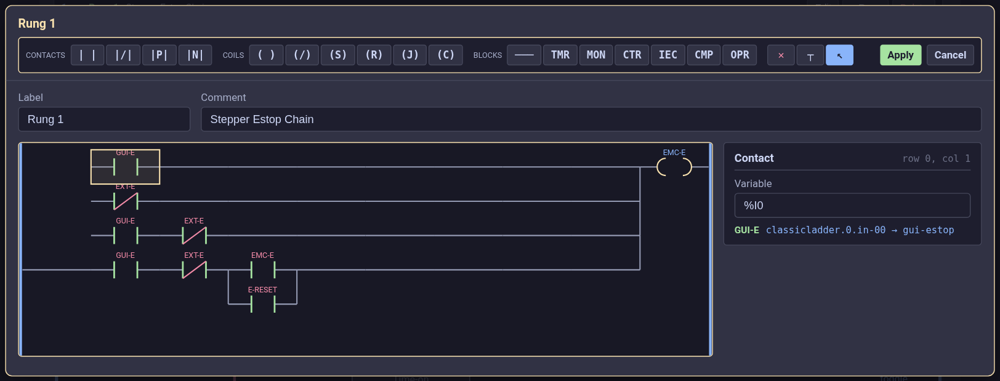
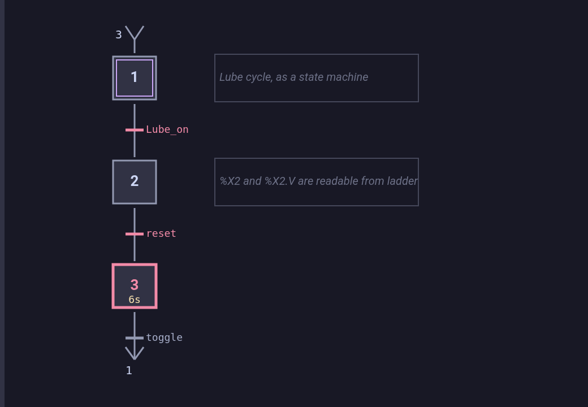
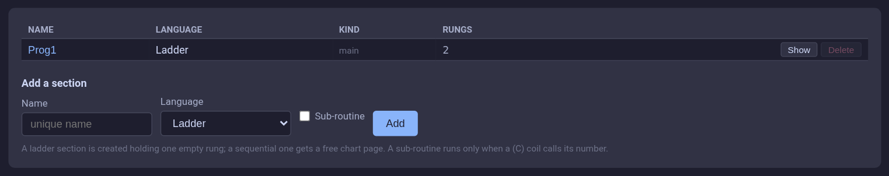
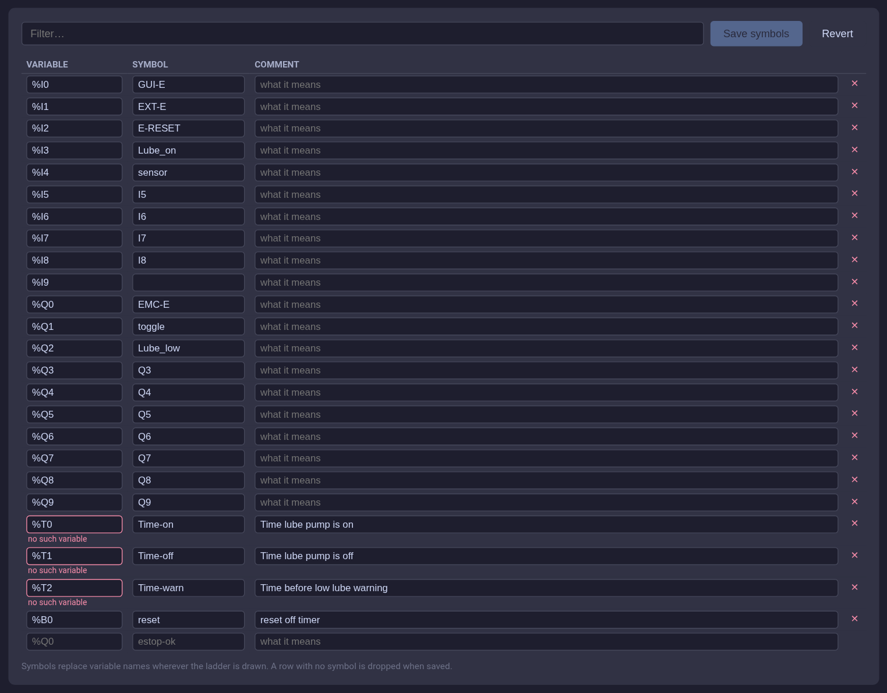
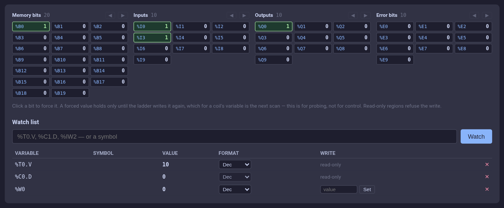
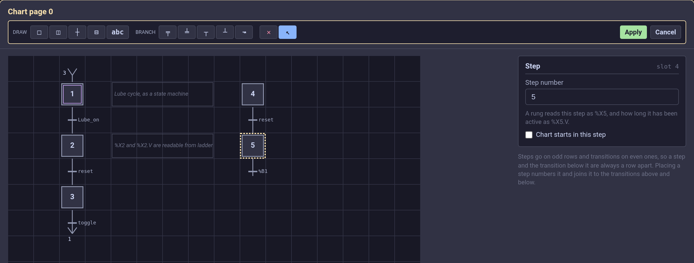
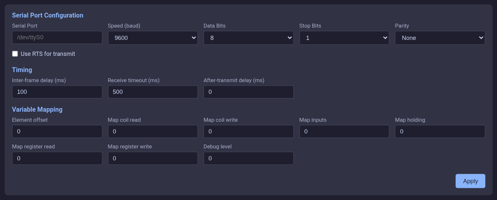

:lang: en
:toc:

[[cha:cl-programming]]
= ClassicLadder Programming

// Custom lang highlight
// must come after the doc title, to work around a bug in asciidoc 8.6.6
:ini: {basebackend@docbook:'':ini}
:hal: {basebackend@docbook:'':hal}
:ngc: {basebackend@docbook:'':ngc}

== Ladder Concepts

(((ClassicLadder Programming,CL Programming)))
ClassicLadder is a type of programming language originally implemented on industrial PLCs (it's called Ladder Programming).
It is based on the concept of relay contacts and coils, and can be used to construct logic checks and functions in a manner that is familiar to many systems integrators.
Ladder consists of rungs that may have branches and resembles an electrical circuit.
It is important to know how ladder programs are evaluated when running.

It seems natural that each line would be evaluated left to right, then the next line down, etc., but it doesn't work this way in ladder logic.
Ladder logic 'scans' the ladder rungs 3 times to change the state of the outputs.

* the inputs are read and updated
* the logic is figured out
* the outputs are set

This can be confusing at first if the output of one line is read by the input of a another rung.
There will be one scan before the second input becomes true after the output is set.

Another gotcha with ladder programming is the "Last One Wins" rule.
If you have the same output in different locations of your ladder the state of the last one will be what the output is set to.

== Languages

The most common language used when working with ClassicLadder is 'ladder'.
ClassicLadder also supports Sequential Function Chart (Grafcet).

== Components

ClassicLadder is a single module, `classicladder`.
It provides the HAL pins and the realtime scan function, loads and saves the ladder program, and serves the editor and the variable monitor over the web interface.
Earlier versions split this into a realtime module `classicladder_rt` and a separate GTK program `classicladder`; both are gone, and configurations that load them will not start.

=== Files

Typically ClassicLadder is loaded from the custom.hal file if you are working from a StepConf generated configuration.

NOTE: Ladder files (.clp) must not contain any blank spaces in the name.

[[sec:ladder-loading]]
=== Loading the module

Loading ClassicLadder is possible from a HAL file, or directly using a halcmd instruction.
The first line loads the module. The second line adds the function classicladder.0.refresh to the servo thread.
This line makes ClassicLadder update at the servo thread rate.

[source,{hal}]
----
load classicladder
addf classicladder.0.refresh servo-thread
----

A trailing argument names the `.clp` project to load:

[source,{hal}]
----
load classicladder myladder.clp
----

When a project is given the PLC starts running as soon as it is loaded.
Without one the module comes up stopped, and a project can be loaded later from the web interface.

NOTE: Only one .clp file can be loaded. If you need to divide your ladder then use sections.

The speed of the thread that ClassicLadder is running in directly affects the responsiveness to inputs and outputs.
If you can turn a switch on and off faster than ClassicLadder can notice it then you may need to speed up the thread.
The fastest that ClassicLadder can update the rungs is one millisecond.
You can put it in a faster thread but it will not update any faster.
If you put it in a slower than one millisecond thread then ClassicLadder will update the rungs slower.
The current scan time is shown in the header of the web interface, rounded to microseconds.
If the scan time is longer than one millisecond you may want to shorten the ladder or put it in a slower thread.

=== Variables

It is possible to configure the number of each type of ladder object while loading the ClassicLadder module.
If you do not configure the number of ladder objects ClassicLadder will use the default values.

[[cap:default-variable-count]]
.Default Variable Count

[width="90%",options="header",cols="<8,<4,<2"]
|===
|Object Name                      | Variable Name    | Default Value
|Number of rungs                  | (numRungs)       | 100
|Number of bits                   | (numBits)        | 100
|Number of word variables         | (numWords)       | 100
|Number of timers                 | (numTimers)      | 10
|Number of timers IEC             | (numTimersIec)   | 10
|Number of monostables            | (numMonostables) | 10
|Number of counters               | (numCounters)    | 10
|Number of HAL inputs bit pins    | (numPhysInputs)  | 15
|Number of HAL output bit pins    | (numPhysOutputs) | 15
|Number of arithmetic expressions | (numArithmExpr)  | 100
|Number of Sections               | (numSections)    | 10
|Number of Symbols                | (numSymbols)     | 200
|Number of S32 inputs             | (numS32in)       | 10
|Number of S32 outputs            | (numS32out)      | 10
|Number of Float inputs           | (numFloatIn)     | 10
|Number of Float outputs          | (numFloatOut)    | 10
|===

Objects of most interest are numPhysInputs, numPhysOutputs, numS32in, and numS32out.

Changing these numbers will change the number of HAL bit pins available.
numPhysInputs and numPhysOutputs control how many HAL bit (on/off) pins are available.
numS32in and numS32out control how many HAL signed integers (+- integer range) pins are available.

For example (you don't need all of these to change just a few):

[source,{hal}]
----
load classicladder numRungs=12 numBits=100 numWords=10
numTimers=10 numMonostables=10 numCounters=10 numPhysInputs=10
numPhysOutputs=10 numArithmExpr=100 numSections=4 numSymbols=200
numS32in=5 numS32out=5
----

To load the default number of objects:

[source,{hal}]
----
load classicladder
----

These sizes are fixed when the module is loaded — the realtime arrays are
allocated once — so changing them means changing the `load` line and restarting,
not editing them from the interface.

=== Modbus options

Modbus is configured through the module's load line and through the web
interface, not through a separate program:

* '--modbus_port=port' is now `modbus_port=N` on the `load classicladder` line,
  which enables the Modbus TCP slave on that port.
* The Modbus master starts by itself whenever the loaded project defines I/O
  requests; see <<sec:ladder-modbus,Modbus>> below.

== Opening ClassicLadder

The editor, the variable monitor and the Modbus panels are one web application,
served by the controller at:

----
http://localhost:5080/app/classicladder/
----

There is nothing to load and nothing to quit: the ladder runs in the controller
whether or not anything is looking at it, and closing the page leaves it
running. Several people can have it open at once, and each sees the same
program and the same live values.

In AXIS you can open it from File/Ladder Editor..., which is greyed out when no
ClassicLadder is loaded. Outside a GUI, the same interface opens in a window of
its own:

----
classicladder
----

== The ClassicLadder web interface

The page has a header showing the state of the PLC and its scan time, a Project
bar for loading and saving the `.clp` file, and a row of tabs.

[[cap:cl-ladder-tab]]
.The Program tab, running

Everything that carries power is drawn in one colour, updated as the machine
runs: a contact that conducts, the wires that carry its output onward, a branch
that reaches a coil from below, the terminals of a running timer. This is the
state the ladder engine itself computed, not a guess made from the variable
values, so what is drawn is what the machine is doing.

The header's Run/Stop button starts and stops the PLC. Starting it is a cold
start: timers, monostables, counters and the edge history of every contact are
reset before the first scan.

=== Project — loading and saving

The Project bar shows the `.clp` file the controller has open. Type a path and
press Save to write the running program to it, or Load to replace the running
program with one from disk.

Paths are resolved by the controller against the configuration directory, so a
bare file name is usually what you want. Save writes the program as it is
running, including edits already applied.

=== Program — the section display and the editor

The Program tab shows one section at a time, chosen with the buttons across the
top, and draws it in whichever language that section is written in: rungs for a
ladder section, a chart for a sequential one.

Each rung carries its number, its label and its comment, and three buttons:

* 'Edit' - opens the rung for editing.
* '+ Rung' - inserts an empty rung after this one.
* 'Delete' - deletes this rung. A section always keeps at least one rung; to
  remove the last one, delete the section.

'Edit' opens the rung in a dialog holding the tools, the grid and the property
panel — everything the edit needs, with nothing to scroll past. The rung is
edited on a copy of itself, and is drawn without the running colours: it is not
the rung the engine is scanning.

[[cap:cl-editor]]
.Editing a rung

Pick a tool, then click a cell to place that element there; click a cell with
the selector tool (↖) to select without placing. Clicking any cell of a block
selects the whole block, which is outlined so it is clear what was picked. The
tools are:

* 'CONTACTS' - normally open, normally closed, rising edge, falling edge.
* 'COILS' - coil, negated coil, set coil, reset coil, jump coil, call coil.
* 'BLOCKS' - horizontal connection, timer, monostable, counter, IEC timer,
  comparison, assignment.
* '✕' - erases the element in the cell you click. Clicking any cell of a block
  removes the whole block.
* '┬' - joins the selected cell to the cell above it, which is how a parallel
  branch is drawn.
* '↖' - stops placing; clicking only selects.

A comparison or an assignment is three cells wide and a timer two cells wide by
two high, so the click marks the top-left of the footprint and the block is
drawn to the right and below it.

'Apply' writes the rung to the controller; 'Cancel', or Escape, throws the
draft away and leaves the running program untouched. If the controller refuses
the rung — a block that runs off the grid, a coil driving a read-only variable,
an expression that does not compile — the reason appears at the top of the page
and the rung stays open for editing.

The Label and Comment fields belong to the rung and are written with it. A
label is what a jump coil offers as a target.

=== Element properties

The panel beside the grid edits whatever is selected. What it offers depends on
the element:

* 'Contacts and coils' take a variable. Type it as it is written (`%I0`, `%B3`,
  `%Q1`) or type its symbol. Below the field the panel names the symbol and the
  HAL pin the variable is carried on, together with the signal connected to
  that pin — which is usually what you actually want to know about someone
  else's ladder.
* 'Timers, monostables and IEC timers' take a block number, a time base and a
  preset counted in units of that base — a base of seconds with a preset of 5
  is five seconds. An IEC timer also takes its mode (TON, TOF, TP). These
  belong to the block rather than to the rung, so they take effect at once and
  Cancel does not undo them.
* 'Counters' take a block number and a preset.
* 'Comparison and assignment' take an expression written in variable names,
  such as `%W0>5` or `%W1:=%IW2+1`. The controller parses and compiles it when
  the rung is applied and refuses the rung if it does not compile.
* 'Jump coils' choose a rung of this section, by number and label.
* 'Call coils' choose a sub-routine by its number.

A comparison or an assignment is given an arithmetic expression of its own when
it is placed. If every expression is already in use the editor says so rather
than sharing one, which would silently rewrite another rung.

=== Sequential sections

Selecting a section whose language is Sequential draws its chart in the same
place, with the active step and the elapsed time in it shown live, and each
transition coloured by its condition. 'Edit chart' opens it for drawing; see
<<sec:ladder-sfc-editing>>.

[[cap:cl-sfc]]
.A sequential section, running

That is the chart in the shipped sim demo
(`configs/sim/axis/classicladder`), which follows the lube pump the second
ladder rung drives: it waits in its initial step until lube is requested, runs a
pump-and-rest cycle, and links back to that initial step, where it starts again
while lube is still called for. The initial step is drawn with a second box
inside it. The step the chart is sitting in is drawn in colour with its `%X.V`
counting under the number, and so is every transition whose condition is true.

The link back is not drawn as a line — across a page of any size it would run
over everything between. Instead both ends get a chevron and the number of the
step at the other end: the one under the last transition says it goes to step 1,
and the one above step 1 says it comes from step 3.

Steps there are numbered from 1 rather than 0, and the editor numbers new steps
the same way. In 2.9 every unused step slot carries the number 0 and is
republished every scan, so a step an author numbered 0 could never be seen from
ladder through `%X0`. This implementation publishes only the steps that exist,
so `%X0` does work here — but a project that has to run under both should leave
0 alone, which is why nothing hands it out by default.

=== Sections

[[cap:cl-sections]]
.The Sections tab

Lists the sections, what language each uses and how many rungs it holds. Click
a name to rename it, 'Show' to display it in the Program tab, 'Delete' to remove
it and the rungs it holds.

The form below adds one. A ladder section is created holding one empty rung; a
sequential section is given a free chart page. Names must be unique. A section
marked as a sub-routine runs only when a call coil names its number; everything
else runs once per scan, in section order.

=== Symbols

[[cap:cl-symbols]]
.The Symbols tab

A symbol is an operator-facing name for a variable — `estop-ok` for `%Q0` — and
is shown instead of the variable wherever the ladder is drawn. Fill in the
blank row at the bottom to add one; the variable name is checked as you type,
so a symbol cannot be attached to a variable this PLC does not have. 'Save
symbols' writes the table; 'Revert' reloads it from the controller.

Keep symbols short so they fit in a cell.

=== Variables

[[cap:cl-variables]]
.The Variables tab

The top half is a grid of the boolean variables: memory bits (`%B`), HAL bit
inputs (`%I`), HAL bit outputs (`%Q`) and error bits (`%E`). Use ◀ and ▶ to
page through a region larger than the grid.

Clicking a bit forces it. A forced value holds only until the ladder writes it
again, which for a coil's variable is the very next scan — this is for probing
a rung, not for controlling a machine. Regions a program may only read refuse
the write.

The watch list below takes any variable at all, by name or by symbol: a timer's
remaining time (`%T0.V`), a counter (`%C1.V`), an IEC timer's output (`%TM0.Q`),
an s32 pin (`%IW2`), a float pin (`%QF0`), a step's elapsed time (`%X3.V`).
Each row shows the live value, in decimal, hex or binary, and offers a write
box for the variables a program may assign to. The list is kept in the browser,
so it survives a reload and is yours rather than the program's.

=== Modbus tabs

'Modbus Config' holds the serial and mapping parameters, 'Modbus I/O' the list
of requests the master issues, and 'Modbus Status' the running counts. See
<<sec:ladder-modbus,Modbus>> below.

== Ladder objects

=== CONTACTS

Represent switches or relay contacts. They are controlled by the variable letter and number assigned to them.

The variable letter can be B, I, or Q and the number can be up to a three digit number, e.g. `%I2`, `%Q3`, or `%B123`.
Variable I is controlled by a HAL input pin with a corresponding number.
Variable B is for internal contacts, controlled by a B coil with a corresponding number.
Variable Q is controlled by a Q coil with a corresponding number (like a relay with multiple contacts).
E.g., if HAL pin `classicladder.0.in-00` is true then %I0 N.O. contact would be on (closed, true, whatever you like to call it).
If %B7 coil is 'energized' (on, true, etc) then %B7 N.O. contact would be on.
If %Q1 coil is 'energized' then %Q1 N.O. contact would be on (and HAL pin `classicladder.0.out-01` would be true).

* 'N.O. Contact' -  image:images/ladder_action_load.png["Normally Open Contact"] (Normally Open)
  When the variable is false the switch is off.
* 'N.C. Contact' - image:images/ladder_action_loadbar.png["Normally Closed Contact"] (Normally Closed)
  When the variable is false the switch is on.
* 'Rising Edge Contact' - When the variable changes from false to true, the switch is PULSED on.
* 'Falling Edge Contact' - When the variable changes from true to false, the switch is PULSED on.

=== IEC TIMERS

Represent new count down timers. IEC Timers replace Timers and Monostables.

IEC Timers have 2 contacts.

* 'I' - input contact
* 'Q' - output contact

There are three modes - TON, TOF, TP.

* 'TON' - When timer input is true countdown begins and continues as long as input remains true.
  After countdown is done and as long as timer input is still true the output will be true.
* 'TOF' - When timer input is true, sets output true. When the input is false the timer counts down then sets output false.
* 'TP' - When timer input is pulsed true or held true timer sets output true till timer counts down. (one-shot)

The time intervals can be set in multiples of 100&8239;ms, seconds, or minutes.

There are also Variables for IEC timers that can be read and/or written to in compare or operate blocks.

* '%TMxxx.Q' - timer done (Boolean, read write)
* '%TMxxx.P' - timer preset (read write)
* '%TMxxx.V' - timer value (read write)

=== TIMERS

Represent count down timers. This is deprecated and replaced by IEC Timers.

Timers have 4 contacts.

* 'E' - enable (input) starts timer when true, resets when goes false
* 'C' - control (input) must be on for the timer to run (usually connect to E)
* 'D' - done (output) true when timer times out and as long as E remains true
* 'R' - running (output) true when timer is running

The timer base can be multiples of milliseconds, seconds, or minutes.

There are also Variables for timers that can be read and/or written to in compare or operate blocks.

* '%Txx.R' - Timer xx running (Boolean, read only)
* '%Txx.D' - Timer xx done (Boolean, read only)
* '%Txx.V' - Timer xx current value (integer, read only)
* '%Txx.P' - Timer xx preset (integer, read or write)

=== MONOSTABLES

Represent the original one-shot timers. This is now deprecated and replaced by IEC Timers.

Monostables have 2 contacts, I and R.

* 'I' - input (input) will start the mono timer running.
* 'R' - running (output) will be true while timer is running.

The I contact is rising edge sensitive meaning it starts the timer only when changing from false to true (or off to on).
While the timer is running the I contact can change with no effect to the running timer.
R will be true and stay true till the timer finishes counting to zero.
The timer base can be multiples of milliseconds, seconds, or minutes.

There are also Variables for monostables that can be read and/or written to in compare or operate blocks.

* '%Mxx.R' - Monostable xx running (Boolean, read only)
* '%Mxx.V' - Monostable xx current value (integer, read only)
* '%Mxx.P' - Monostable xx preset (integer, read or write)

=== COUNTERS

Represent up/down counters.

There are 7 contacts:

* 'R' - reset (input) will reset the count to 0.
* 'P' - preset (input) will set the count to the preset number assigned in the property panel.
* 'U' - up count (input) will add one to the count.
* 'D' - down count (input) will subtract one from the count.
* 'E' - under flow (output) will be true when the count rolls over from 0 to 9999.
* 'D' - done (output) will be true when the count equals the preset.
* 'F' - overflow (output) will be true when the count rolls over from 9999 to 0.

The up and down count contacts are edge sensitive meaning they only count when the contact changes from false to true (or off to on if you prefer).

The range is 0 to 9999.

There are also Variables for counters that can be read and/or written to in compare or operate blocks.

* '%C'__xx__`.D` - Counter _xx_ done (_Boolean_, _read only_)
* '%C'__xx__`.E` - Counter _xx_ empty overflow (_Boolean_, _read only__)
* '%C'__xx__`.F` - Counter _xx_ full overflow (_Boolean_, _read only_)
* '%C'__xx__`.V` - Counter _xx_ current value (_integer_, _read_ or _write_)
* '%C'__xx__`.P` - Counter _xx_ preset (_integer_, _read_ or _write_)

=== COMPARE

For arithmetic comparison. Is variable %XXX = to this number (or evaluated number)

The compare block will be true when comparison is true. You can use most math symbols:

* `+`, `-`, `*`, `/`, `=` (standard math symbols)
* `<` (less than), `>` (greater than), `<=` (less or equal), `>=` (greater or equal), `<>` (not equal)
* `(`, `)` separate into groups example `%IF1=2,&%IF2<5` in pseudo code translates to if %IF1 is equal to 2 and %IF2 is less than 5 then the comparison is true.
  Note the comma separating the two groups of comparisons.
* `^` (exponent), `%` (modulus), `&` (and), `|` (or),. -
* `ABS` (absolute), `MOY` (French for average), `AVG` (average)

For example ABS(%W2)=1, MOY(%W1,%W2)<3.

No spaces are allowed in the comparison equation.
For example `%C0.V>%C0.P` is a valid comparison expression while `%C0.V > %CO.P` is not a valid expression.

There is a list of Variables down the page that can be used for reading from and writing to ladder objects.
When a new compare block is opened be sure and delete the `#` symbol when you enter a compare.

To find out if word variable #1 is less than 2 times the current value of counter #0 the syntax would be:

----
%W1<2*%C0.V
----

To find out if S32in bit 2 is equal to 10 the syntax would be:

----
%IW2=10
----

Note: Compare uses the arithmetic equals not the double equals that programmers are used to.

=== VARIABLE ASSIGNMENT

For variable assignment, e.g. assign this number (or evaluated number) to this variable %xxx,
there are two math functions MINI and MAXI that check a variable for maximum (0x80000000) and minimum values (0x07FFFFFFF) (think signed values) and keeps them from going beyond.

When a new variable assignment block is opened be sure to delete the `#` symbol when you enter an assignment.

To assign a value of 10 to the timer preset of IEC Timer 0 the syntax would be:

----
%TM0.P=10
----

To assign the value of 12 to s32out bit 3 the syntax would be:

----
%QW3=12
----

[NOTE]
When you assign a value to a variable with the variable assignment block the value is retained until you assign a new value using the variable assignment block.
The last value assigned will be restored when LinuxCNC is started.

The following figure shows an Assignment and a Comparison Example.
%QW0 is a S32out bit and %IW0 is a S32in bit.
In this case the HAL pin `classicladder.0.s32out-00` will be set to a value of 5 and when the HAL pin `classicladder.0.s32in-00` is 0 the HAL pin `classicladder.0.out-00` will be set to True.

[[cap:assign-compare-example]]
.Assign/Compare Ladder Example
image::images/AssignCompare-Ladder.png["Assign/Compare Example",align="center"]

.Assignment Expression Example
image::images/Assignment_Expression.png[align="center"]

.Comparison Expression Example
image::images/Comparison_Expression.png[align="center"]

=== COILS

Coils represent relay coils. They are controlled by the variable letter and number assigned to them.

The variable letter can be B or Q and the number can be up to a three digit number, e.g., %Q3, or %B123.
Q coils control HAL out pins, e.g. if %Q15 is energized then HAL pin classicladder.0.out-15 will be true.
B coils are internal coils used to control program flow.

* 'N.O. COIL' - A relay coil: When coil is energized, then its contact that is normally open (short: N.O.) will be closed (turned on, true, etc.) and the current may pass.
* 'N.C. COIL' - A relay coil that inverses its contacts:
  When coil is energized, then its contact that is normally closed (short: N.C.) will be opened (turned off, false, etc) and the current flow is interrupted.
* 'SET COIL' - A relay coil with latching contacts:
  When coil is energized then its N.O. contact will be latched closed.
* 'RESET COIL' - A relay coil with latching contacts:
  When coil is energized then its N.O. contact will be latched open.
* 'JUMP COIL' - A 'goto' coil:
  When coil is energized then the ladder program jumps to a rung (in the CURRENT section) - jump points are designated by a rung label.
  (Set a rung's label in the Label field while editing it.)
* 'CALL COIL' - A 'gosub' coil:
  When coil is energized then the program jumps to a subroutine section designated by a subroutine number - subroutines are designated SR0 to SR9 (designate them in the section manager).

[WARNING]
If you use a N.C. contact with a N.C. coil the logic will work (when the coil is energized the contact will be closed) but that is really hard to follow!

==== JUMP COIL

A JUMP COIL is used to 'JUMP' to another section, like a goto in BASIC programming language.

Press 'Edit' on the rung you want to jump to and type a name into the Label
field beside the tools. There is a Comment field next to it as well.
The label names this rung only, and is what a JUMP COIL offers as a target.

Place a JUMP COIL in the rightmost position of the rung that should jump, and
pick the target from the list in the property panel — it shows each rung of the
section by number and label.

==== CALL COIL

A CALL COIL is used to go to a subroutine section then return, like a gosub in BASIC programming language.

Go to the Sections tab and fill in the form at the bottom: a name, the language
(ladder or sequential), and tick Sub-routine to give it a number (SR0 for
example). The section is created holding one empty rung.

Press 'Show' on it to build your sub-routine, then 'Show' on your main section
(default name prog1) to go back.

Now you can add a CALL COIL to your program. CALL COILs are to be placed at the rightmost position in the rung.

Remember to change the label to the subroutine number you chose before.

== ClassicLadder Variables

These Variables are used in COMPARE or OPERATE to get information about, or change specs of, ladder objects such as changing a counter preset, or seeing if a timer is done running.

List of variables :

* `%B`__xxx__ - Bit memory _xxx_ (Boolean)
* `%W`__xxx__ - Word memory _xxx_ (32 bits signed integer)
* `%IW`__xxx__ - Word memory _xxx_ (S32 in pin)
* `%QW`__xxx__ - Word memory _xxx_ (S32 out pin)
* `%IF`__xx__ - Word memory _xx_ (Float in pin) (*converted to S32 in ClassicLadder*)
* `%QF`__xx__ - Word memory _xx_ (Float out pin) (*converted to S32 in ClassicLadder*)
* `%T`__xx__`.R` - Timer _xx_ running (Boolean, user read only)
* `%T`__xx__`.D` - Timer _xx_ done (Boolean, user read only)
* `%T`__xx__`.V` - Timer _xx_ current value (integer, user read only)
* `%T`__xx__`.P` - Timer _xx_ preset (integer)
* `%TM`__xxx__`.Q` - Timer _xxx_ done (Boolean, read write)
* `%TM`__xxx__`.P` - Timer _xxx_ preset (integer, read write)
* `%TM`__xxx__`.V` - Timer _xxx_ value (integer, read write)
* `%M`__xx__`.R` - Monostable _xx_ running (Boolean)
* `%M`__xx__`.V` - Monostable _xx_ current value (integer, user read only)
* `%M`__xx__`.P` - Monostable _xx_ preset (integer)
* `%C`__xx__`.D` - Counter _xx_ done (Boolean, user read only)
* `%C`__xx__`.E` - Counter _xx_ empty overflow (Boolean, user read only)
* `%C`__xx__`.F` - Counter _xx_ full overflow (Boolean, user read only)
* `%C`__xx__`.V` - Counter _xx_ current value (integer)
* `%C`__xx__`.P` - Counter _xx_ preset (integer)
* `%I`__xxx__ - Physical input _xxx_ (Boolean) (HAL input bit)
* `%Q`__xxx__ - Physical output _xxx_ (Boolean) (HAL output bit)
* `%X`__xxx__ - Activity of step _xxx_ (sequential language)
* `%X`__xxx__`.V` - Time of activity in seconds of step _xxx_ (sequential language)
* `%E`__xx__ - Errors (Boolean, read write(will be overwritten))
* 'Indexed or vectored variables' - These are variables indexed by another variable.
  Some might call this vectored variables.
  Example: `%W0[%W4]` => if %W4 equals 23 it corresponds to %W23

== GRAFCET (State Machine) Programming

[WARNING]
This is probably the least used and most poorly understood feature of ClassicLadder.
Sequential programming is used to make sure a series of ladder events always happen in a prescribed order.
Sequential programs do not work alone.
There is always a ladder program as well that controls the variables.
Here are the basic rules governing sequential programs:

* Rule 1 : Initial situation - The initial situation is characterized by the initial steps which are by definition in the active state at the beginning of the operation.
  There shall be at least one initial step.
* Rule 2 : R2, Clearing of a transition - A transition is either enabled or disabled.
  It is said to be enabled when all immediately preceding steps linked to its corresponding transition symbol are active, otherwise it is disabled.
  A transition cannot be cleared unless it is enabled, and its associated transition condition is true.
* Rule 3 : R3, Evolution of active steps - The clearing of a transition simultaneously leads to the active state of the immediately following step(s) and to the inactive state of the immediately preceding step(s).
* Rule 4 : R4, Simultaneous clearing of transitions - All simultaneous cleared transitions are simultaneously cleared.
* Rule 5 : R5, Simultaneous activation and deactivation of a step - If during operation, a step is simultaneously activated and deactivated, priority is given to the activation.

A sequential chart is displayed by selecting its section, and is made of these
parts.

* 'ORDINARY STEP' - has a unique number for each one
* 'STARTING STEP' - a sequential program must have one. This is where the program will start.
* 'TRANSITION' - shows the variable that must be true for control to pass through to the next step.
* 'STEP AND TRANSITION' - combined for convenience
* 'TRANSITION LINK-DOWNSIDE' - splits the logic flow to one of two possible lines based on which of the next steps is true first (Think OR logic)
* 'TRANSITION LINK=UPSIDE' - combines two (OR) logic lines back in to one
* 'PASS-THROUGH LINK-DOWNSIDE' - splits the logic flow to two lines that BOTH must be true to continue (Think AND logic)
* 'PASS-THROUGH LINK-UPSIDE' - combines two concurrent (AND logic) logic lines back together
* 'JUMP LINK' - connects steps that are not underneath each other such as connecting the last step to the first
* 'COMMENT BOX' - used to add comments

With sequential programming: The variable `%X`__xxx__ (e.g., `%X5`) is used to see if a step is active.
The variable `%X`__xxx__`.V` (e.g., `%X5.V`) is used to see how long the step has been active.
The %X and %X.v variables are use in LADDER logic. The variables assigned to the transitions (e.g., %B) control whether the logic will pass to the next step.
After a step has become active the transition variable that caused it to become active has no control of it anymore.
The last step has to JUMP LINK back only to the beginning step.

[[sec:ladder-sfc-editing]]
=== Drawing a chart

[[cap:cl-sfc-edit]]
.The chart editor, with a second chain being drawn

'Edit chart', above a sequential section, opens the page for editing. As with a
rung, the editor works on a copy: 'Apply' sends the chart to the controller and
'Cancel' (or Escape) throws the copy away. Unlike a rung, the whole chart goes
at once — a step is named by its slot everywhere a transition refers to it, so
one edit can rewire several elements and there is no smaller piece that leaves
the chart consistent.

The page is a grid sixteen cells square. *Steps go on odd rows and transitions
on even ones*, so a step and the transition below it are always one row apart.
The editor enforces that, and it is what makes the two conveniences below work.

The 'Draw' tools place one element per click, and clicking what they placed
takes it away again:

* 'Step' and 'Initial step'. A new step is numbered from the step two rows above
  it, or with the lowest number nothing else is using, and is joined to the
  transitions immediately above and below.
* 'Transition'. A new transition takes its condition from the transition two
  rows above it, one variable offset on, and is joined to the steps immediately
  above and below.
* 'Step with a transition below it' does both in one click, which is how a chain
  is drawn: click straight down the column.
* 'Comment' takes four cells across, and needs all four free.

The 'Branch' tools take *two clicks*: the first names one end, the second the
other, and only then does anything change. Everything between the two, on that
row, joins the branch.

* 'Start parallel steps' / 'End parallel steps' — click the first and the last
  step of the row. A transition on the row above (for a start) or below (for an
  end) takes them all on at once, or waits for all of them. This is AND.
* 'Start alternative branches' / 'End alternative branches' — click the first
  and the last transition of the row. Whichever becomes true first is taken.
  This is OR.
* 'Link' — click a transition and a step. The upper half of the transition links
  its top end, the lower half its bottom end. This is how a chart returns to its
  beginning: the two ends are drawn as a chevron and the number of the step at
  the other end, because a line across the page would run over everything
  between.

The eraser deletes what is clicked, and takes the deleted element out of every
transition that referred to it — a transition left pointing at a step that is
no longer drawn would still be evaluated by the engine.

The panel beside the chart edits what the selected element holds: a step's
number and whether the chart starts in it, a transition's condition variable
(written as a variable or as a symbol), or a comment's text. Everything else
about an element is decided by where it is placed.

Applying a chart restarts it from its initial steps. It has to: the steps being
replaced are named by slot, so carrying the activity across an edit would light
whatever moved into that slot.

The controller checks a chart before it applies any of it, so a refused chart
leaves the running one alone and the reason is shown above the tools. It
refuses a transition naming a step that is not on the chart or is on another
page, two steps sharing a number (they would share one `%X` bit), two elements
in one cell, a one-sided link between transitions, and a transition that both
takes and gives the same step — that one would fire on every scan for ever.

[[sec:ladder-modbus]]
== Modbus

Things to consider:

* Modbus is a non-realtime program so it might have latency issues on a heavily laden computer.
* Modbus is not really suited to hard real time events such as position control of motors or to control E-stop.
* Modbus runs in the controller with the ladder; nothing has to be open for it to run.
* Modbus is not fully finished so it does not do all modbus functions.

The Modbus master needs nothing on the load line: it starts by itself whenever
the loaded project defines I/O requests. The integrated Modbus TCP slave is
started only when a port is named with the `modbus_port=N` load argument:

.Loading Modbus
----
load classicladder myprogram.clp modbus_port=1502
----

.Modbus Functions
* '1' - read coils
* '2' - read inputs
* '3' - read holding registers
* '4' - read input registers
* '5' - write single coils
* '6' - write single register
* '8' - echo test
* '15' - write multiple coils
* '16' - write multiple registers

[[cap:config-io]]
.The Modbus I/O tab

[[cap:config-coms]]
.The Modbus Config tab

* 'SERIAL PORT' - For IP blank. For serial the location/name of serial driver, e.g., /dev/ttyS0 ( or /dev/ttyUSB0 for a USB-to-serial converter).
* 'SERIAL SPEED' - Should be set to speed the slave is set for - 300, 600, 1200, 2400, 4800, 9600, 19200, 38400, 57600, 115200 are supported.
* 'PAUSE AFTER TRANSMIT' - Pause (milliseconds) after transmit and before receiving answer, some devices need more time (e.g., USB-to-serial converters).
* 'PAUSE INTER-FRAME' - Pause (milliseconds) after receiving answer from slave.
  This sets the duty cycle of requests (it's a pause for EACH request).
* 'REQUEST TIMEOUT LENGTH' - Length (milliseconds) of time before we decide that the slave didn't answer.
* 'MODBUS ELEMENT OFFSET' - used to offset the element numbers by 1 (for manufacturers numbering differences).
* 'DEBUG LEVEL' - Set this to 0-3 (0 to stop printing debug info besides no-response errors).
* 'READ COILS/INPUTS MAP TO' - Select what variables that read coils/inputs will update. (B or Q).
* 'WRITE COILS MAP TO' - Select what variables that write coils will updated from (B,Q,or I).
* 'READ REGISTERS/HOLDING' - Select what variables that read registers will update (W or QW).
* 'WRITE REGISTERS MAP TO' - Select what variables that read registers will updated from (W, QW, or IW).
* 'SLAVE ADDRESS' - For serial the slaves ID number usually settable on the slave device (usually 1-256).
  For IP the slave IP address plus optionally the port number.
* 'TYPE ACCESS' - This selects the MODBUS function code to send to the slave (eg what type of request).
* 'COILS / INPUTS' - Inputs and Coils (bits) are read from/written to I, B, or Q variables (user selects).
* 'REGISTERS (WORDS)' - Registers (Words/Numbers) map to IW, W, or QW variables (user selects).
* '1st MODBUS ELEMENT' - The address (or register number) of the first element in a group (remember to set MODBUS ELEMENT OFFSET properly).
* 'NUMBER OF ELEMENTS' - The number of elements in this group.
* 'LOGIC' - You can invert the logic here.
* '1st%I%Q IQ WQ MAPPED' - This is the starting number of %B, %I, %Q, %W, %IW, or %QW variables that are mapped onto/from the modbus element group (starting at the first modbus element number).

In the example above: Port number - for my computer /dev/ttyS0 was my serial port.

The serial speed is set to 9600 baud.

Slave address is set to 12 (on my VFD I can set this from 1-31, meaning I can talk to 31 VFDs maximum on one system).

The first line is set up for 8 input bits starting at the first register number (register 1).
So register numbers 1-8 are mapped onto ClassicLadder's %B variables starting at %B1 and ending at %B8.

The second line is set for 2 output bits starting at the ninth register number (register 9) so register numbers 9-10 are mapped onto ClassicLadder's %Q variables starting at %Q9 ending at %Q10.

The third line is set to write 2 registers (16 bits each) starting at the 0^th^ register number (register 0),
so register numbers 0-1 are mapped onto ClassicLadder's %W variables starting at %W0 ending at %W1.

It's easy to make an off-by-one error as sometimes the modbus elements are referenced starting at one rather then 0 (actually by the standard that is the way it's supposed to be!).
You can use the modbus element offset radio button to help with this.

The documents for your modbus slave device will tell you how the registers are set up- there is no standard way.

The SERIAL PORT, PORT SPEED, PAUSE, and DEBUG level are editable for changes; nothing takes effect until 'Apply' is pressed on the Modbus Config tab.

To use the echo function select the echo function and add the slave number you wish to test.
You don't need to specify any variables.

The number 257 will be sent to the slave number you specified and the slave should send it back.
Raise the debug level on the Modbus Config tab and the exchange is written to the controller's log.

== MODBUS Settings

Serial:

* ClassicLadder uses RTU protocol (not ASCII).
* 8 data bits, No parity is used, and 1 stop bit is also known as 8-N-1.
* Baud rate must be the same for slave and master.
  ClassicLadder can only have one baud rate so all the slaves must be set to the same rate.
* Pause inter frame is the time to pause after receiving an answer.
* MODBUS_TIME_AFTER_TRANSMIT is the length of pause after sending a request and before receiving an answer (this apparently helps with USB converters which are slow).

=== MODBUS Info

* ClassicLadder can use distributed inputs/outputs on modules using the Modbus protocol ("master": polling slaves).
* The slaves and their I/O are configured on the Modbus Config and Modbus I/O tabs.
* 2 exclusive modes are available : ethernet using Modbus/TCP and serial using Modbus/RTU.
* No parity is used.
* If no port name for serial is set, TCP/IP mode will be used...
* The slave address is the slave address (Modbus/RTU) or the IP address.
* The IP address can be followed per the port number to use (xx.xx.xx.xx:pppp) else the port 502 will be used per default.
* 2 products have been used for tests: a Modbus/TCP one (Adam-6051, https://www.advantech.com) and a serial Modbus/RTU one (http://www.ipac.ws).
* See examples: adam-6051 and modbus_rtu_serial.
* Web links: https://www.modbus.org and this interesting one: http://www.iatips.com/modbus.html
* MODBUS TCP SERVER INCLUDED
* ClassicLadder has a Modbus/TCP server integrated. It has no default port: it is started only when a port is named with the `modbus_port=N` load argument.
  (Binding a port below 1024, including the standard 502, requires that the controller runs with the privilege to do so.)
* List of Modbus functions code supported are: 1, 2, 3, 4, 5, 6, 15 and 16.
* Modbus bits and words correspondence table is actually not parametric and correspond directly to the %B and %W variables.

More information on modbus protocol is available on the internet.

https://www.modbus.org/[https://www.modbus.org/]

=== Communication Errors

If there is a communication error %E0 becomes true, and the error count on the
Modbus Status tab goes up.
Modbus will continue to try to communicate. The %E0 could be used to make a decision based on the error.
A timer could be used to stop the machine if timed out, etc.

== Debugging modbus problems

A good reference for the protocol: https://www.modbus.org/docs/Modbus_Application_Protocol_V1_1b.pdf.
Raise the debug level on the Modbus Config tab and the controller logs the
Modbus commands and the slaves' responses.

Here we set ClassicLadder to request slave 1, to read holding registers (function code 3) starting at address 8448 (0x2100).
We ask for 1 (2 byte wide) data element to be returned.
We map it to a ClassicLadder variable starting at 2.

That is the request shown on the Modbus I/O tab above. With the read and
written holding registers mapped to ClassicLadder's `%W` variables on the
Modbus Config tab, and the data mapped starting at the 2nd element, the
returned data lands in `%W2`.

=== Request

Lets look at an example of reading one hold register at 8448 Decimal (0x2100 Hex).

Looking in the Modbus protocol reference:

.Read holding register request
[width="50%",options="header",cols="<6,<2,<6"]
|===
|Name                | number of bytes | Value (hex)
|Function code       | (1 Byte)        | 3  (0x03)
|Starting Address    | (2 Bytes)       | 0 - 65535 (0x0000 to 0xFFFF)
|Number of Registers | (2 Bytes)       | 1 to 125 (0x7D)
|Checksum            | (2 bytes)       | Calculated automatically
|===

Here is an example sent command, as 2.9 printed it (all Hex):

----
INFO CLASSICLADDER-   Modbus I/O module to send: Lgt=8 <-  Slave address-1  Function code-3  Data-21 0 0 1 8E 36
----

Meaning (Hex):

* Lgt = 8 = message is 8 bytes long including slave number and checksum number
* Slave number = 1 (0x1) = Slave address 1
* Function code = 3 (0x3) = read holding register
* Start at address = highbyte 33 (0x21) lowbyte 0 (0x00) = combined address = 8448 (0x2100)
* Number of Registers = 1 (0x1) = return 1 2-byte register (holding and reading registers are always 2 bytes wide)
* Checksum = high byte 0x8E lowbyte 0x36  = (0x8E36)

=== Error response

If there is an error response, it sends the function code plus 0x80, an error code, and a checksum.
Getting an error response means the slave is seeing the request command but can not give valid data.
Looking in the Modbus protocol reference:

.Error returned for function code 3 (read holding register)
[width="50%",options="header",cols="<6,<2,<6"]
|===
| Name           | Number of bytes | Value (hex)
| Error code     | 1 Byte          | 131 (0x83)
| Exception code | 1 Byte          | 1-4 (0x01 to 0x04)
| Checksum       | (2 bytes)       | Calculated automatically
|===

Exception code meaning:

* 1 - illegal Function
* 2 - illegal data address
* 3 - illegal data value
* 4 - slave device failure

Here is an example received command, as 2.9 printed it (all Hex):

----
INFO CLASSICLADDER-   Modbus I/O module received: Lgt=5 ->   (Slave address-1  Function code-83 ) 2 C0 F1
----

Meaning (Hex): +

* Slave number = 1 (0x1) = Slave address 1
* Function code = 131 (0x83) =  error while reading holding register
* Error code = 2  (0x2) = illegal data address requested
* Checksum = (0x8E36)

=== Data response

Looking in the Modbus protocol reference for Response:

.Data response for function code 3 (read holding register)
[width="50%",options="header",cols="<6,<2,<6"]
|===
|Name           | number of bytes | Value (hex)
|Function code  | 1 Byte          | 3 (0x03)
|Byte count     | 1 Byte          | 2 x N*
|Register value | N* x 2 Bytes    | returned value of requested address
|Checksum       | (2 bytes)       | calculated automatically
|===

*N = Number of registers

Here is an example received command, as 2.9 printed it (all Hex):

----
INFO CLASSICLADDER-   Modbus I/O module received: Lgt=7 ->   (Slave address-1  Function code-3 2 0 0 B8 44)
----

meaning (Hex):

* Slave number = 1 (0x1) = Slave address 1
* Requested function code = 3 (0x3) = read holding register requested
* count of byte registers = 2 (0x1) = return 2 bytes (each register value is 2 bytes wide)
* value of highbyte = 0 (0x0) = high byte value of address 8448 (0x2100)
* value of lowbyte = 0 (0x0) = high byte value of address 8448 (0x2100)
* Checksum = (0xB844)

(high and low bytes are combined to create a 16 bit value and then transferred to ClassicLadder's variable.)
Read Registers can be mapped to %W or %QW  (internal memory or HAL out pins).
Write registers can be mapped from %W, %QW or %IW (internal memory, HAL out pins or HAL in pins).
The variable number will start at the number entered in the modbus I/O registry setup page's column: 'First variable mapped'.
If multiple registers are requested in one read/write then the variable number are sequential after the first one.

=== MODBUS Bugs

* In compare blocks the function %W=ABS(%W1-%W2) is accepted but does not compute properly. only %W0=ABS(%W1) is currently legal.
* reading/writing multiple registers in Modbus has checksum errors.

== Setting up ClassicLadder

In this section we will cover the steps needed to add ClassicLadder to an
existing configuration. ClassicLadder is added by hand, with the
`load classicladder ...` line described in <<sec:ladder-loading,Loading the
module>> — the StepConf Wizard cannot add it for you.

=== Add the Module

To add ClassicLadder, put two lines in the custom.hal file.
This line loads the module:

[source,{hal}]
----
load classicladder
----

This line adds the ClassicLadder function to the servo thread:

[source,{hal}]
----
addf classicladder.0.refresh servo-thread
----

=== Adding Ladder Logic

Start your config and select "File/Ladder Editor", or open
`http://localhost:5080/app/classicladder/` in a browser.
The Program tab shows one empty rung of the one section a fresh program has.

Press 'Edit' on that rung. The editing tools appear above it and the rung is
drawn as a full grid — ten cells across and six rows down. A rung is evaluated
left to right; the rows are branches, and power flows from the left rail
through whatever conducts.

Pick the normally open contact (`| |`) from the CONTACTS group and click the
top-left cell. The contact appears there, and the property panel on the right
opens on it.

Type the variable it should read into the Variable field — `%I0` for the first
HAL bit input — and press Enter. The panel confirms what it understood: the
symbol if the variable has one, and the HAL pin it is carried on.

Now pick the coil (`( )`) from the COILS group, click the top-right cell, and
give it `%Q0`. Pick the horizontal connection (`───`) and click the cells
between the two so power can reach the coil.

Press 'Apply'. The rung is written to the controller and starts being scanned;
if it is refused, the reason appears at the top of the page and the rung stays
open so you can correct it.

Nothing is on disk yet — Apply changes the running program. Open the Project
bar at the top, type a file name, and press Save.

The path is resolved by the controller against the running config directory, so
a bare file name lands beside the rest of your configuration.

To have that ladder loaded at start-up, name it on the module's load line:

[source,{hal}]
----
load classicladder MyLadder.clp
----

With the file named there, the PLC comes up running your program, and
"File/Ladder Editor" opens on it.

// vim: set syntax=asciidoc:
